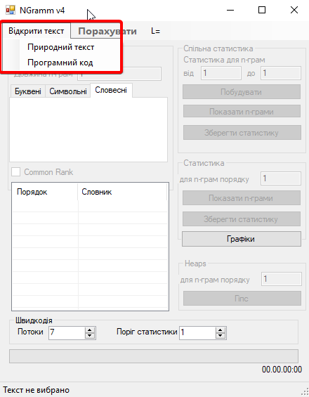
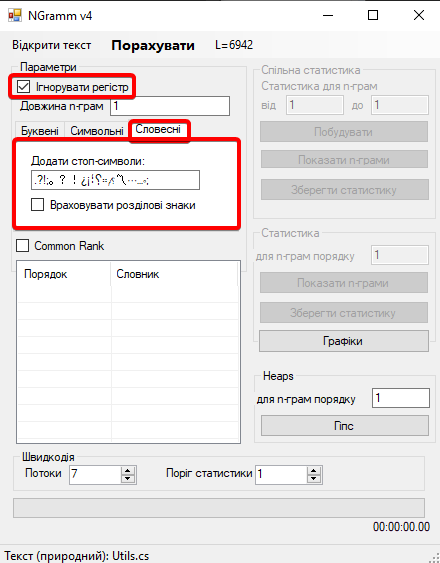
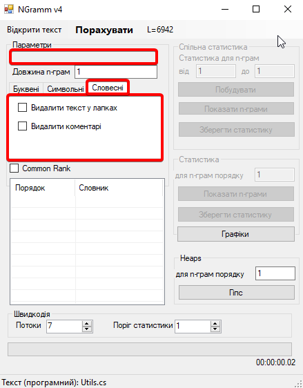

# NGramm
 
## Що зроблено?
### Функціонал
1. Додано новий вид токенізації текстів, а саме **токенізатор програмного коду** (TokenizerUtils.TokenizeCode).[Детільніше у  наступній секції](#як-токенізується-програмний-код)

2. **Для аналізу програмого коду текст розбивається на n частин**. Кожна з яких має свій тип: **code/string/comment (CodeBlock)**, кожна з яких обробляється окремим токенізатором (NgrammProcessor). [Детільніше у  наступній секції](#як-працює-розбивання-програмного-коду-на-частини-codestringcomment)
   
3. **Було змінено структуру (але не принцип роботи) NgrammProcessor. Клас розбито на декілька підкласів** (CodeNaturalNgrammProcessor, NaturalNgrammProcessor, ComplexNgrammProcessor) та базовий абстрактний клас (BasicNgrammProcessor). Кожен з яких має свою реалізацію та необхідний для токенізації програмного та природнього текстів. 
[Детільніше у  наступній секції](#за-що-відповідає-кожен-із-ngrammprocessor)

4. Змінено конструктор класів токенізаторів NgrammProcessor. **Раніше вони самі читали файл, а тепер очікують на вхід string з відповідним текстом для обробки.**   
Це було зроблено оскільки для програмного коду текст розбивається на частини (code/string/comment) і раніше доводилось для кожної з цих частин створювати свій файл з текстом цієї частини, що призводило до неоптимізованої обробки. Завдяки цьому оновленню проблема зникла.
   
5. Оптимізація - замінено ряд методів на більш оптимізовані версії. Regex на вбудовані в C# методи обробки strings.

### Меню
1. Додано можливість відкрити **природний текст**/**програмний код**:

2. **Для програмного коду змінено меню словесної обробки тексту**. Зникає опція "Ігнорувати регістр". Та з'являються нові опції "Видалити текст у лапках", "Видалити коментарі" - для регулювання обробки *з врахуванням/без врахування* *strings/comments* частин.

Приклад меню **"словесного режиму" для природного тексту**:

Приклад меню **"словесного режиму" для програмного коду**:

## За що відповідає кожен із NgrammProcessor

- **BasicNgrammProcessor** - базовий абстрактний клас токенізатора, який використовується для опису загального функціоналу кожного із NgrammProcessor;

- **NaturalNgrammProcessor** - токенізатор природних текстів (функціонал залишився незмінним);

- **CodeNaturalNgrammProcessor** - токенізатор для програмного коду (не враховуючи strings та comments);

- **ComplexNgrammProcessor** - токенізатор, який об'єднує ряд CodeNaturalNgrammProcessor та NaturalNgrammProcessor. Дає змогу обробляти окремо code, strings, comments частини тесту та об'єднувати їх рангові таблиці в одну спільнну;

## Як працює розбивання програмного коду на частини code/string/comment

В загальному процес розбивається на 2 етапи:

1. Первинна підготовка тексту:

 - 1.1 Зчитується розширення та кодування файлу, що дозволяє нам читати файли більшості мов. Також дозволяє визначати які знаки ми вважаємо коментарями, оскільки вони залежать від мови.

 - 1.2 Первинний обхід тексту -- ми шукаємо знаки початку коментарів та стрінгів (як однорядкових так і багаторядкових) та розбиваємо даний нам текст на блоки природнього та програмного тексту, зберігаючи порядок.

 - 1.3 У результаті віддаємо список блоків у початковій послідовності, кожен з яких класифікований.

2. Токенізація блоків.

 - 2.1 На вхід отримуємо список блоків, де, в залежності від типу блоку, використовуємо відповідний токенізатор.

 - 2.2 На виході отримуємо дві групи н-грам, для природнього та програмного тексту, які в подальшому об'єднюємо.

## Як токенізується програмний код?

 Для створення програми, яка гнучко токенізує більшість мов, було описано 3 класи 'слів' у програмному тексті:

 - Команди (->, '', #, !=, +)

 - Тексти (print, bool, is, not)

 - Цифри (12, 10, 1.1, 1411)

Цифри довелось винести в окремний клас для правильної обробки десяткових чисел, як одне слово, а не набір з слів число-команда-число.

Сам цикл можна описати наступним чином:

 1. Описуємо змінну current = null, в яку будемо посимвольно добавляти частину слова.

 2. Починаючи з першого символа, шукаємо не пустий символ (не пробіл), та добавляємо його в current.

 3. В залежності від типу минулого символу вибираємо дію над наступний, якщо він такого ж типу як і минулий, добавляємо його у current, інакше рахуємо що ми наткнулися на наступне слово.

 4. Обробляємо винятки з 3 кроку, ось деякі з них:

    - Символи . , ] } ) [ { ( ніколи не є частиною команди, тобто ці символи не можуть бути складовою слова, коли натикаємось на них, вважаємо їх за слово з одного символа.

    - Для текстів допускається використання _ як частини тексту.

    - Для цифр допускається використання . як розділювача дробової частини.

 5. Повторюємо кроки 1-4, доки не пройдемо всі символи даного тексту
